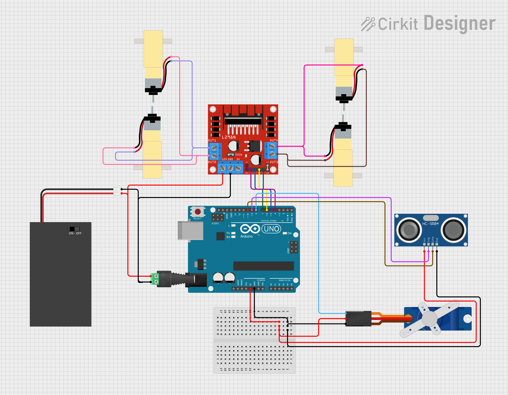

# [MakerEdu Creator] Xe tránh vật cản
## Tóm tắt ý tưởng:
Xe tránh vật cản DIY.
## Mô tả tính năng:
Xe tránh vật cản nhờ vào cảm biến siêu âm.
## Chuẩn bị phần cứng và kết nối:
### Chuẩn bị:

<table class="tg">
<thead>
  <tr>
    <th class="tg-baqh">STT</th>
    <th class="tg-baqh">Tên thiết bị </th>
    <th class="tg-baqh">SL</th>
    <th class="tg-baqh">Link</th>
  </tr>
</thead>
<tbody>
  <tr>
    <td class="tg-baqh">1</td>
    <td class="tg-73oq">Mạch Uno SMD CH340 (Arduino Uno Compatible).</td>
    <td class="tg-baqh">1 cái</td>
    <td class="tg-baqh"><a href="https://hshop.vn/products/arduino-uno-r3-smd-chip-don">Link</a></td>
  </tr>
  <tr>
    <td class="tg-baqh">2</td>
    <td class="tg-0lax">Khung Xe Robot Chasiss 4WD Car R1.</td>
    <td class="tg-baqh">1 cái</td>
    <td class="tg-baqh"><a href="https://hshop.vn/products/khung-xe-robot-chasiss-4wd-car-r1">Link</a></td>
  </tr>
  <tr>
    <td class="tg-baqh">3</td>
    <td class="tg-0lax">Động Cơ DC Giảm Tốc V1 Dual Shaft Plastic Geared TT Motor + Bánh Xe.</td>
    <td class="tg-baqh">4 cái</td>
    <td class="tg-baqh"><a href="https://hshop.vn/products/dong-co-dc-giamtoc-v1-1-48">Link</a></td>
  </tr>
  <tr>
    <td class="tg-baqh">4</td>
    <td class="tg-0lax">Hộp Pin 2 X 18650 Battery Holder Có Công Tắc.</td>
    <td class="tg-baqh">1 cái</td>
    <td class="tg-baqh"><a href="https://hshop.vn/products/hop-pin-2-co-18650-co-cong-tac">Link</a></td>
  </tr>
  <tr>
    <td class="tg-baqh">5</td>
    <td class="tg-0lax">Breadboard Mini 170 Lỗ 45x34x9mm.</td>
    <td class="tg-baqh">1 cái</td>
    <td class="tg-baqh"><a href="https://hshop.vn/products/test-board-cammini-35-x-47mm">Link</a></td>
  </tr>
  <tr>
    <td class="tg-baqh">6</td>
    <td class="tg-0lax">Cảm Biến Siêu Âm Ultrasonic HC-SR04</td>
    <td class="tg-baqh">1 cái</td>
    <td class="tg-baqh"><a href="https://hshop.vn/products/cam-bien-sieu-am-srf04">Link</a></td>
  </tr>
  <tr>
    <td class="tg-baqh">7</td>
    <td class="tg-0lax">Mạch Điều Khiển Động Cơ L298 DC Motor Driver.</td>
    <td class="tg-baqh">1 cái</td>
    <td class="tg-baqh"><a href="https://hshop.vn/products/mach-dieu-khien-dong-co-dc-l298">Link</a></td>
  </tr>
  <tr>
    <td class="tg-baqh">8</td>
    <td class="tg-0lax">Đầu Chuyển Domino Sang Giắc DC Đực 2.1mm.</td>
    <td class="tg-baqh">1 cái</td>
    <td class="tg-baqh"><a href="https://hshop.vn/products/dau-chuyen-domino-sang-giac-dc-duc-2-1mm">Link</a></td>
  </tr>
  <tr>
    <td class="tg-baqh">9</td>
    <td class="tg-0lax">Dây Điện Đỏ Đen.</td>
    <td class="tg-baqh">1 m </td>
    <td class="tg-baqh"><a href="https://hshop.vn/products/day-dien-do-den">Link</a></td>
  </tr>
  <tr>
    <td class="tg-baqh">10</td>
    <td class="tg-0lax">Dây bus đực - cái.</td>
    <td class="tg-baqh">1 tép</td>
    <td class="tg-baqh"><a href="https://hshop.vn/products/day-camtest-board-duc-coi20cm40soi">Link</a></td>
  </tr>
  <tr>
    <td class="tg-0lax">11</td>
    <td class="tg-0lax">Dây bus đực - đực.</td>
    <td class="tg-0lax">1 tép</td>
    <td class="tg-0lax"><a href="https://hshop.vn/products/day-camtest-board-duc-duc-20cm40soi">Link</a></td>
  </tr>
    <tr>
    <td class="tg-0lax">12</td>
    <td class="tg-0lax">Động Cơ RC Servo 9G.</td>
    <td class="tg-0lax">1 cái</td>
    <td class="tg-0lax"><a href="https://hshop.vn/products/dong-co-rc-servo-9g">Link</a></td>
  </tr>
</tbody>
</table>

### Kết nối:

|   UNO  |  5V | GND |  D8  |  D9  | D10  |
|:------:|:---:|:---:|:----:|:----:|------|
| HCSR04 | VCC | GND |      | TRIG | ECHO |
| SERVO  | ĐỎ  | NÂU | VÀNG |      |      |

|  UNO  |  D4 |  D5 |  D6 |  D7 |  VIN | GND |
|:-----:|:---:|:---:|:---:|:---:|:----:|:---:|
|  L298 | IN1 | IN2 | IN3 | IN4 | +12V | GND |
| NGUỒN |     |     |     |     | VBAT | GND |

|   L298   | OUT1 | OUT2 | OUT3 | OUT4 |
|:--------:|:----:|:----:|:----:|:----:|
| ĐỘNG CƠ  |  DC1 |  DC1 |  DC2 |  DC2 |



## Chuẩn bị kiến thức:
- Nếu là lần đầu tiên sử dụng phần mềm Arduino, các bạn cần thực hiện đầy đủ các bước trong hướng dẫn <a href="https://wiki.makerlab.vn/index.php/H%C6%B0%E1%BB%9Bng_d%E1%BA%ABn_s%E1%BB%AD_d%E1%BB%A5ng_ph%E1%BA%A7n_m%E1%BB%81m_Arduino_v%E1%BB%9Bi_c%C3%A1c_m%E1%BA%A1ch_Vietduino_%2B_MakerEdu_Shield_for_Vietduino">tại đây</a>.
- Nếu các phần cứng trong bài là hoàn toàn mới với các bạn, để có thể nắm được cách hệ thống vận hành, các bạn cần đọc và tìm hiểu về cách sử dụng của từng phần cứng tại trang Wiki của <a href="https://wiki.makerlab.vn/index.php/Main_Page">Makerlab</a>.
 
## Code Arduino cho thiết bị:
```Cpp
#include <HCSR04.h>
#include <Makerlabvn_SimpleMotor.h>
#include <Servo.h>

#define ANGLE_L 180
#define ANGLE_C 90
#define ANGLE_R 0

#define DELAYSERVO 500
#define MOTORSPEED 30
#define DELAYROTATE 500
#define DELAYBW 400

Makerlabvn_SimpleMotor Driver(4, 5, 6, 7);
HCSR04 Scaner(9, 10);
Servo Rotater;

long marktime = 0;
int Ultrasonic_interval;
int distance;
const int threshold_distance = 30;

enum {
  RB_FF,
  RB_BB,
  RB_RL,
  RB_RR,
};
int RB_state = RB_FF;

void setup() {
  Serial.begin(9600);
  Rotater.attach(8);
  Rotater.write(ANGLE_C);
  delay(DELAYSERVO);
}

void loop() {
  switch (RB_state) {
    case RB_FF:
      chaytoi();
      break;
    case RB_RL:
      xoaytrai();
      break;
    case RB_RR:
      xoayphai();
      break;
  }
}


bool chaytoi() {
  if(Rotater.read()!=ANGLE_C){
  Rotater.write(ANGLE_C);
  delay(DELAYSERVO);
  }
  if (Ultradistance_Scan() < threshold_distance) {
    Driver.car_stop();
    RB_state = RB_RL;
  } else {
    Driver.car_fw(MOTORSPEED, MOTORSPEED);
  }
}

bool xoaytrai() {
  Rotater.write(ANGLE_L);
  delay(DELAYSERVO);
  if (Ultradistance_Scan() < threshold_distance) {
    Driver.car_stop();
    RB_state = RB_RR;
  } else {
    Rotater.write(ANGLE_C);
    delay(DELAYSERVO);
    Driver.car_rotateL(MOTORSPEED);
    delay(DELAYROTATE);
    Driver.car_stop();
    RB_state = RB_FF;
  }
}

bool xoayphai() {
  Rotater.write(ANGLE_R);
  delay(DELAYSERVO);
  if (Ultradistance_Scan() < threshold_distance) {
    Rotater.write(ANGLE_C);
    delay(DELAYSERVO);
    Driver.car_bw(MOTORSPEED, MOTORSPEED);
    delay(DELAYBW);
    Driver.car_stop();
    RB_state = RB_RL;
  } else {
    Rotater.write(ANGLE_C);
    delay(DELAYSERVO);
    Driver.car_rotateR(MOTORSPEED);
    delay(DELAYROTATE);
    RB_state = RB_FF;
  }
}

int Ultradistance_Scan() {
  distance = Scaner.dist();
  delay(60);
  return distance;
}

```