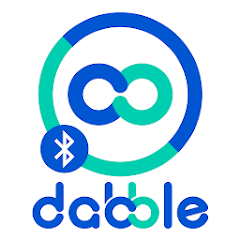
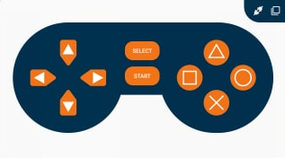
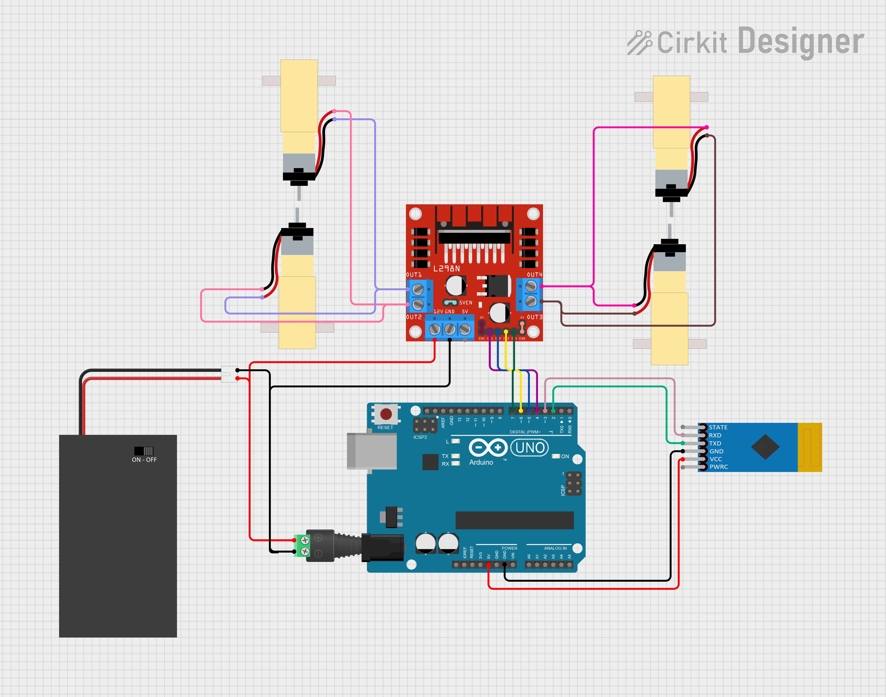

# [MakerEdu Creator] XE ĐIỀU KHIỂN BẰNG SMARTPHONE
## Tóm tắt ý tưởng:
Xe điều khiển bằng bluetooth DIY.
## Mô tả tính năng:
Điều khiển xe qua bluetooth bằng ứng dụng Dabble   
- <a href="https://play.google.com/store/apps/details?id=io.dabbleapp&hl=vi&gl=US">Android</a>
- [IOS](https://apps.apple.com/us/app/dabble-bluetooth-controller/id1472734455)  


Giao diện điều khiển được sử dụng là Gamepad.



### Hướng dẫn:
- Nhấn giữ ( ˅, ˄ , ˂ , ˃ ) để điều khiển xe.
- Khi buông các nút trên thì xe ngừng di chuyển.
## Chuẩn bị phần cứng và kết nối:
### Chuẩn bị:

<table class="tg">
<thead>
  <tr>
    <th class="tg-baqh">STT</th>
    <th class="tg-baqh">Tên thiết bị </th>
    <th class="tg-baqh">SL</th>
    <th class="tg-baqh">Link</th>
  </tr>
</thead>
<tbody>
  <tr>
    <td class="tg-baqh">1</td>
    <td class="tg-73oq">Mạch Uno SMD CH340 (Arduino Uno Compatible).</td>
    <td class="tg-baqh">1 cái</td>
    <td class="tg-baqh"><a href="https://hshop.vn/products/arduino-uno-r3-smd-chip-don">Link</a></td>
  </tr>
  <tr>
    <td class="tg-baqh">2</td>
    <td class="tg-0lax">Khung Xe Robot Chasiss 4WD Car R1.</td>
    <td class="tg-baqh">1 cái</td>
    <td class="tg-baqh"><a href="https://hshop.vn/products/khung-xe-robot-chasiss-4wd-car-r1">Link</a></td>
  </tr>
  <tr>
    <td class="tg-baqh">3</td>
    <td class="tg-0lax">Động Cơ DC Giảm Tốc V1 Dual Shaft Plastic Geared TT Motor + Bánh Xe.</td>
    <td class="tg-baqh">4 cái</td>
    <td class="tg-baqh"><a href="https://hshop.vn/products/dong-co-dc-giamtoc-v1-1-48">Link</a></td>
  </tr>
  <tr>
    <td class="tg-baqh">4</td>
    <td class="tg-0lax">Hộp Pin 2 X 18650 Battery Holder Có Công Tắc.</td>
    <td class="tg-baqh">1 cái</td>
    <td class="tg-baqh"><a href="https://hshop.vn/products/hop-pin-2-co-18650-co-cong-tac">Link</a></td>
  </tr>
  <tr>
    <td class="tg-baqh">5</td>
    <td class="tg-0lax">Breadboard Mini 170 Lỗ 45x34x9mm.</td>
    <td class="tg-baqh">1 cái</td>
    <td class="tg-baqh"><a href="https://hshop.vn/products/test-board-cammini-35-x-47mm">Link</a></td>
  </tr>
  <tr>
    <td class="tg-baqh">6</td>
    <td class="tg-0lax">Module Bluetooth 3.0 SPP / BLE 4.2 Dual Mode JDY-33 (HC-05 / HC-06 Compatible).</td>
    <td class="tg-baqh">1 cái</td>
    <td class="tg-baqh"><a href="https://hshop.vn/products/mach-thu-phat-bluetooth-dual-mode-3-0-spp-ble-4-2-jdy-33-hc-05-hc-06-compatible">Link</a></td>
  </tr>
  <tr>
    <td class="tg-baqh">7</td>
    <td class="tg-0lax">Mạch Điều Khiển Động Cơ L298 DC Motor Driver.</td>
    <td class="tg-baqh">1 cái</td>
    <td class="tg-baqh"><a href="https://hshop.vn/products/mach-dieu-khien-dong-co-dc-l298">Link</a></td>
  </tr>
  <tr>
    <td class="tg-baqh">8</td>
    <td class="tg-0lax">Đầu Chuyển Domino Sang Giắc DC Đực 2.1mm.</td>
    <td class="tg-baqh">1 cái</td>
    <td class="tg-baqh"><a href="https://hshop.vn/products/dau-chuyen-domino-sang-giac-dc-duc-2-1mm">Link</a></td>
  </tr>
  <tr>
    <td class="tg-baqh">9</td>
    <td class="tg-0lax">Dây Điện Đỏ Đen.</td>
    <td class="tg-baqh">1 m </td>
    <td class="tg-baqh"><a href="https://hshop.vn/products/day-dien-do-den">Link</a></td>
  </tr>
  <tr>
    <td class="tg-baqh">10</td>
    <td class="tg-0lax">Dây bus đực - cái.</td>
    <td class="tg-baqh">1 tép</td>
    <td class="tg-baqh"><a href="https://hshop.vn/products/day-camtest-board-duc-coi20cm40soi">Link</a></td>
  </tr>
  <tr>
    <td class="tg-0lax">11</td>
    <td class="tg-0lax">Dây bus đực - đực.</td>
    <td class="tg-0lax">1 tép</td>
    <td class="tg-0lax"><a href="https://hshop.vn/products/day-camtest-board-duc-duc-20cm40soi">Link</a></td>
  </tr>
</tbody>
</table>

### Kết nối:

| UNO    | D2  | D3  | 5V  | GND |
|:------:|-----|-----|-----|-----|
| JDY-33 | TX  | RX  | 5V  | GND |

|  UNO  |  D4 |  D5 |  D6 |  D7 |  VIN | GND |
|:-----:|:---:|:---:|:---:|:---:|:----:|:---:|
|  L298 | IN1 | IN2 | IN3 | IN4 | +12V | GND |
| NGUỒN |     |     |     |     | VBAT | GND |

|   L298   | OUT1 | OUT2 | OUT3 | OUT4 |
|:--------:|:----:|:----:|:----:|:----:|
| ĐỘNG CƠ  |  DC1 |  DC1 |  DC2 |  DC2 |




## Chuẩn bị kiến thức:
- Nếu là lần đầu tiên sử dụng phần mềm Arduino, các bạn cần thực hiện đầy đủ các bước trong hướng dẫn <a href="https://wiki.makerlab.vn/index.php/H%C6%B0%E1%BB%9Bng_d%E1%BA%ABn_s%E1%BB%AD_d%E1%BB%A5ng_ph%E1%BA%A7n_m%E1%BB%81m_Arduino_v%E1%BB%9Bi_c%C3%A1c_m%E1%BA%A1ch_Vietduino_%2B_MakerEdu_Shield_for_Vietduino">tại đây</a>.
- Nếu các phần cứng trong bài là hoàn toàn mới với các bạn, để có thể nắm được cách hệ thống vận hành, các bạn cần đọc và tìm hiểu về cách sử dụng của từng phần cứng tại trang Wiki của <a href="https://wiki.makerlab.vn/index.php/H%C6%B0%E1%BB%9Bng_d%E1%BA%ABn_s%E1%BB%AD_d%E1%BB%A5ng_ph%E1%BA%A7n_m%E1%BB%81m_Arduino_v%E1%BB%9Bi_c%C3%A1c_m%E1%BA%A1ch_Vietduino_%2B_MakerEdu_Shield_for_Vietduino">Makerlab</a>.
## Code Arduino cho thiết bị:
```Cpp
/**
 * Tilte: Bluetooth Car R1
 * Author: Mika
 * Date: 05/17/2024
 * Version: v1.0
 * Purpose: This code is for reference
*/

// INCLUDE LIBRARIES
#include "Dabble.h"
#include <SoftwareSerial.h>
#include "Makerlabvn_SimpleMotor.h"

// DEFINE
#define PIN_IN1 4
#define PIN_IN2 5
#define PIN_IN3 6
#define PIN_IN4 7
#define PIN_TX_BLE 2
#define PIN_RX_BLE 3
#define SPEED 100

// OBJECT INITIALIZATION
Makerlabvn_SimpleMotor demoMotor(PIN_IN1, PIN_IN2, PIN_IN3, PIN_IN4);
SoftwareSerial mySerial(PIN_TX_BLE, PIN_RX_BLE);


void setup() {
  // put your setup code here, to run once:
  demoMotor.car_stop();    // Let the car stop
  mySerial.begin(115200);  // Initialize mySerial baudrate communication
  Serial.begin(115200);    // Initialize Serial baudrate communication
  Dabble.begin(mySerial);  // Initialize Dabble baudrate communication
}


void loop() {
  // put your main code here, to run repeatedly:
  Dabble.processInput();             // Receive information from Dabble app
  if (GamePad.isUpPressed()) {       // When UP BUTTON is pressed
    demoMotor.car_fw(SPEED, SPEED);  // Let the car go foward
  } else {
    if (GamePad.isDownPressed()) {     // When DOWN BUTTON is pressed
      demoMotor.car_bw(SPEED, SPEED);  // Let the car go backward
    } else {
      if (GamePad.isLeftPressed()) {   // When LEFT BUTTON is pressed
        demoMotor.car_rotateL(SPEED);  // Let the car turn left
      } else {
        if (GamePad.isRightPressed()) {  // When RIGHT BUTTON is pressed
          demoMotor.car_rotateR(SPEED);  // Let the car turn right
        } else {                         // When no button is pressed
          demoMotor.car_stop();          // Let the car stop
        }
      }
    }
  }
}
``` 

