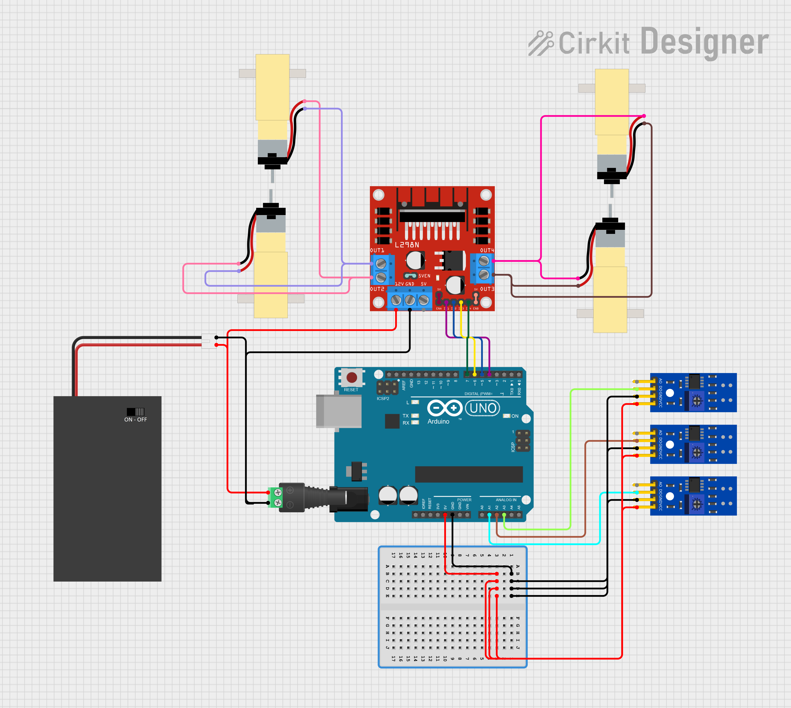

# [MakerEdu Creator] Xe dò line
## Tóm tắt ý tưởng:
Xe dò line DIY.
## Mô tả tính năng:
Xe dò line bằng cảm biến dò line.
## Chuẩn bị phần cứng và kết nối:
### Chuẩn bị:

<table class="tg">
<thead>
  <tr>
    <th class="tg-baqh">STT</th>
    <th class="tg-baqh">Tên thiết bị </th>
    <th class="tg-baqh">SL</th>
    <th class="tg-baqh">Link</th>
  </tr>
</thead>
<tbody>
  <tr>
    <td class="tg-baqh">1</td>
    <td class="tg-73oq">Mạch Uno SMD CH340 (Arduino Uno Compatible).</td>
    <td class="tg-baqh">1 cái</td>
    <td class="tg-baqh"><a href="https://hshop.vn/products/arduino-uno-r3-smd-chip-don">Link</a></td>
  </tr>
  <tr>
    <td class="tg-baqh">2</td>
    <td class="tg-0lax">Khung Xe Robot Chasiss 4WD Car R1.</td>
    <td class="tg-baqh">1 cái</td>
    <td class="tg-baqh"><a href="https://hshop.vn/products/khung-xe-robot-chasiss-4wd-car-r1">Link</a></td>
  </tr>
  <tr>
    <td class="tg-baqh">3</td>
    <td class="tg-0lax">Động Cơ DC Giảm Tốc V1 Dual Shaft Plastic Geared TT Motor + Bánh Xe.</td>
    <td class="tg-baqh">4 cái</td>
    <td class="tg-baqh"><a href="https://hshop.vn/products/dong-co-dc-giamtoc-v1-1-48">Link</a></td>
  </tr>
  <tr>
    <td class="tg-baqh">4</td>
    <td class="tg-0lax">Hộp Pin 2 X 18650 Battery Holder Có Công Tắc.</td>
    <td class="tg-baqh">1 cái</td>
    <td class="tg-baqh"><a href="https://hshop.vn/products/hop-pin-2-co-18650-co-cong-tac">Link</a></td>
  </tr>
  <tr>
    <td class="tg-baqh">5</td>
    <td class="tg-0lax">Breadboard Mini 170 Lỗ 45x34x9mm.</td>
    <td class="tg-baqh">1 cái</td>
    <td class="tg-baqh"><a href="https://hshop.vn/products/test-board-cammini-35-x-47mm">Link</a></td>
  </tr>
  <tr>
    <td class="tg-baqh">6</td>
    <td class="tg-0lax">Cảm Biến Dò Line Đơn TCRT5000 Line Follower Sensor</td>
    <td class="tg-baqh">3 cái</td>
    <td class="tg-baqh"><a href="https://hshop.vn/products/cam-bien-do-line-don">Link</a></td>
  </tr>
  <tr>
    <td class="tg-baqh">7</td>
    <td class="tg-0lax">Mạch Điều Khiển Động Cơ L298 DC Motor Driver.</td>
    <td class="tg-baqh">1 cái</td>
    <td class="tg-baqh"><a href="https://hshop.vn/products/mach-dieu-khien-dong-co-dc-l298">Link</a></td>
  </tr>
  <tr>
    <td class="tg-baqh">8</td>
    <td class="tg-0lax">Đầu Chuyển Domino Sang Giắc DC Đực 2.1mm.</td>
    <td class="tg-baqh">1 cái</td>
    <td class="tg-baqh"><a href="https://hshop.vn/products/dau-chuyen-domino-sang-giac-dc-duc-2-1mm">Link</a></td>
  </tr>
  <tr>
    <td class="tg-baqh">9</td>
    <td class="tg-0lax">Dây Điện Đỏ Đen.</td>
    <td class="tg-baqh">1 m </td>
    <td class="tg-baqh"><a href="https://hshop.vn/products/day-dien-do-den">Link</a></td>
  </tr>
  <tr>
    <td class="tg-baqh">10</td>
    <td class="tg-0lax">Dây bus đực - cái.</td>
    <td class="tg-baqh">1 tép</td>
    <td class="tg-baqh"><a href="https://hshop.vn/products/day-camtest-board-duc-coi20cm40soi">Link</a></td>
  </tr>
  <tr>
    <td class="tg-0lax">11</td>
    <td class="tg-0lax">Dây bus đực - đực.</td>
    <td class="tg-0lax">1 tép</td>
    <td class="tg-0lax"><a href="https://hshop.vn/products/day-camtest-board-duc-duc-20cm40soi">Link</a></td>
  </tr>
</tbody>
</table>

### Kết nối:

| UNO              | A1  | A2  | A3  | 5V | GND |
|:----------------:|-----|-----|-----|----|-----|
| TCRT 5000 (Trái) |     |     | DO | 5V | GND |
| TCRT 5000 (Giữa) |     | DO |     | 5V | GND |
| TCRT 5000 (Phải) | DO |     |     | 5V | GND |

|  UNO  |  D4 |  D5 |  D6 |  D7 |  DC+ | DC- |
|:-----:|:---:|:---:|:---:|:---:|:----:|:---:|
|  L298 | IN1 | IN2 | IN3 | IN4 |  VCC | GND |
| NGUỒN |     |     |     |     |   +  |  -  |

|   L298   | OUT1 | OUT2 | OUT3 | OUT4 |
|:--------:|:----:|:----:|:----:|:----:|
| ĐỘNG CƠ  |  DC1 |  DC1 |  DC2 |  DC2 |



## Chuẩn bị kiến thức:
- Nếu là lần đầu tiên sử dụng phần mềm Arduino, các bạn cần thực hiện đầy đủ các bước trong hướng dẫn <a href="https://wiki.makerlab.vn/index.php/H%C6%B0%E1%BB%9Bng_d%E1%BA%ABn_s%E1%BB%AD_d%E1%BB%A5ng_ph%E1%BA%A7n_m%E1%BB%81m_Arduino_v%E1%BB%9Bi_c%C3%A1c_m%E1%BA%A1ch_Vietduino_%2B_MakerEdu_Shield_for_Vietduino">tại đây</a>.
- Nếu các phần cứng trong bài là hoàn toàn mới với các bạn, để có thể nắm được cách hệ thống vận hành, các bạn cần đọc và tìm hiểu về cách sử dụng của từng phần cứng tại trang Wiki của <a href="https://wiki.makerlab.vn/index.php/Main_Page">Makerlab</a>.
 
## Code Arduino cho thiết bị:
```Cpp
/**
 * Tilte: Line Tracking Car R1 With 3 Sensor
 * Author: Mika
 * Date: 05/18/2024
 * Version: v1.0
 * Purpose: This code is for reference
*/

// INCLUDE LIBRARIES
#include "Makerlabvn_SimpleMotor.h"

// DEFINE
#define PIN_OUT1 A1     //! A1
#define PIN_OUT2 A2     //! A2
#define PIN_OUT3 A3     //! A3
#define PIN_IN1 4       //! D4
#define PIN_IN2 5       //! D5
#define PIN_IN3 6       //! D6
#define PIN_IN4 7       //! D7
#define DELAY_CAR 1000  //Set delay time for the car


// OBJECT INITIALIZATION
Makerlabvn_SimpleMotor demoMotor(PIN_IN1, PIN_IN2, PIN_IN3, PIN_IN4);

// VARIABLE
const float threshold_right = 0.5;  // Threshold of the right sensor
const float threshold_left = 0.5;   // Threshold of the left sensor
const float threshold_mid = 0.5;    // Threshold of the mid sensor
int last_lost_dir;                  // The variable stores the value of the vehicle's state before losing the line
const int left_dir = 1;             // The variable stores the states that the vehicle is on the left side of the line
const int right_dir = 0;            // The variable stores the states that the vehicle is on the right side of the line
const int speedForward = 35;        // The variable stores the vehicle's speed value when run with fast speed
const int speedForwardlow = 15;     // The variable stores the vehicle's speed value when run with low speed
const int speedStop = 0;            // The variable stores the vehicle's speed value when stop

/* RUN ONCE TIME WHEN START */
void setup() {
  last_lost_dir = left_dir;  // Set the state variable before losing the line
  // Let the car stop about DELAY_CAR
  demoMotor.car_stop();
  delay(DELAY_CAR);
}
/* RUN LOOP AFTER SETUP RUN */
void loop() {
  // Store the value read from the sensor into a variable
  int eye_Left_Value = digitalRead(A3);
  int eye_Right_Value = digitalRead(A1);
  int eye_Mid_Value = digitalRead(A2);
  // When the Mid sensor read the line
  if ((eye_Mid_Value > threshold_mid)) {

    demoMotor.car_fw(speedForward, speedForward);  // Let the car go forward

  } else {
    // When the Left and the Mid sensor read the line, but the Right doesn't
    if ((eye_Left_Value > threshold_left) && (eye_Right_Value < threshold_right) && (eye_Mid_Value > threshold_mid)) {

      demoMotor.car_fw(speedForwardlow, speedForward);  // Let the car go forward to the left

    } else {
      // When the Right and the Mid sensor read the line, but the Left doesn't
      if ((eye_Left_Value < threshold_left) && (eye_Right_Value > threshold_right) && (eye_Mid_Value > threshold_mid)) {

        demoMotor.car_fw(speedForward, speedForwardlow);  // Let the car go forward to the right

      } else {
        // When the Left sensor read the line, but the Right and the Mid don't
        if ((eye_Left_Value > threshold_left) && (eye_Right_Value < threshold_right) && (eye_Mid_Value < threshold_mid)) {

          last_lost_dir = right_dir;  // Before losing the line, the car was on the right

          demoMotor.car_fw(speedStop, speedForward);  // Let the car turn LEFT
        } else {
          // When the Right sensor read the line, but the Left and the Mid don't
          if ((eye_Left_Value < threshold_left) && (eye_Right_Value > threshold_right) && (eye_Mid_Value < threshold_mid)) {

            last_lost_dir = left_dir;  // // Before losing the line, the car was on the left

            demoMotor.car_fw(speedForward, speedStop);  // Let the car turn RIGHT

          } else {
            // When the car lost the line
            if (last_lost_dir == left_dir) {  // If the car was on the left last time

              demoMotor.car_rotateR(speedForward);  // Let the car turn RIGHT

            } else {

              demoMotor.car_rotateL(speedForward);  // Let the car turn LEFT
            }
          }
        }
      }
    }
  }
}
```